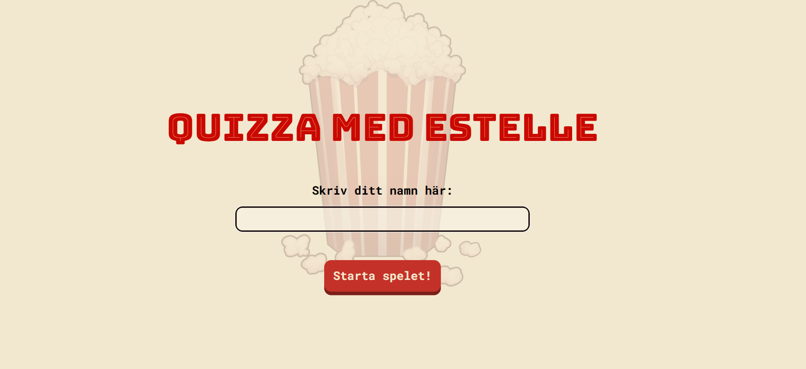
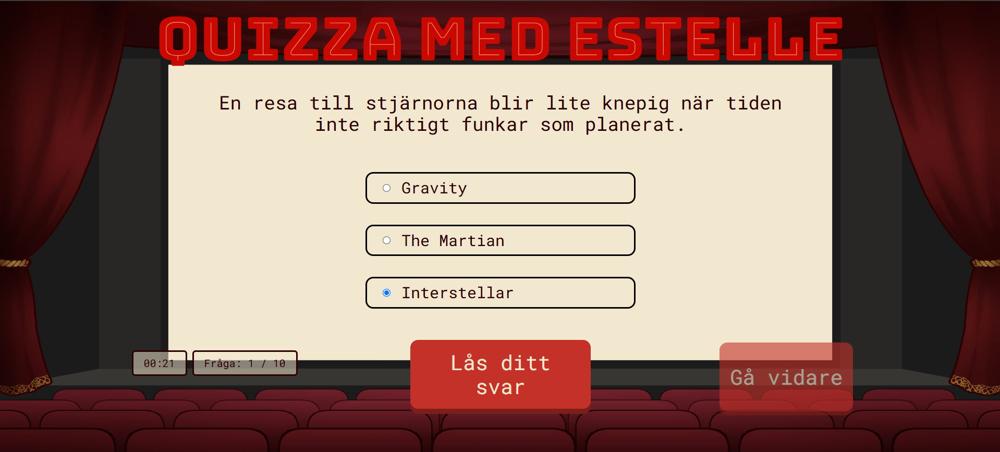
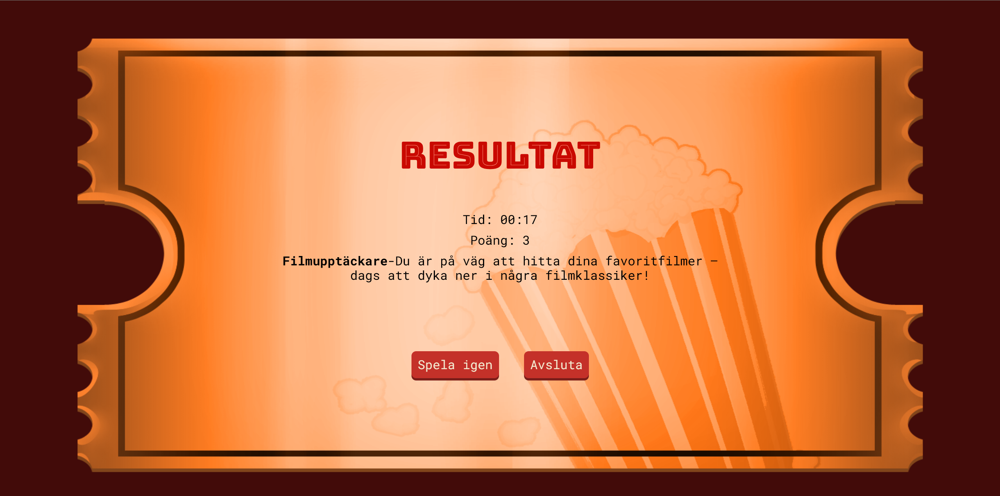
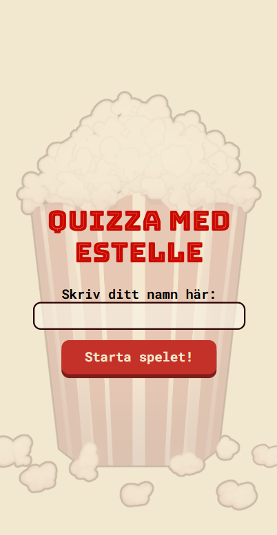
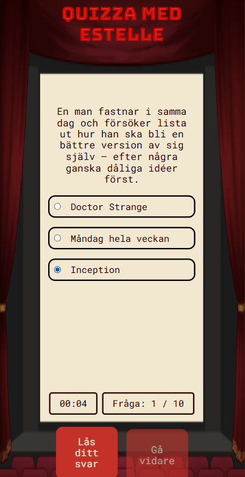
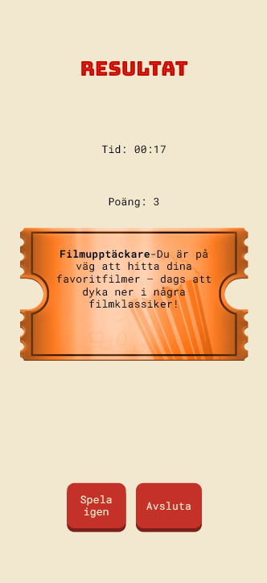
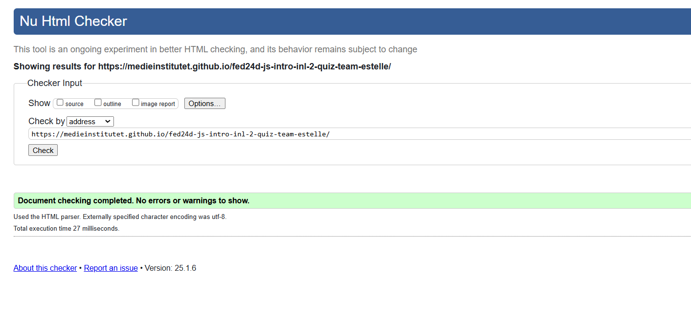
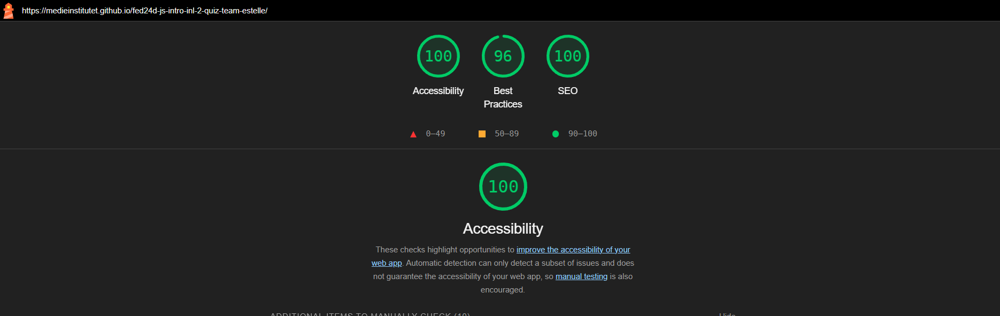

# Quizza med Estelle
Welcome to our movie-themed quiz application, **Quizza med Estelle**! This project was developed as part of our JavaScript course, where we explored interactive web development and leveraged TypeScript for the first time. The application focuses on delivering an engaging user experience, adhering to modern web development practices, and showcasing collaborative team efforts. 

## 🚀 Project Overview 
Our movie quiz is an interactive web application designed to test users' movie knowledge while providing an engaging and user-friendly experience. This project exemplifies modern web development practices while showcasing our ability to collaborate effectively in a team setting, leveraging agile methodologies for structured and efficient progress. It demonstrates:

 - **Modern and accessible HTML structure**: Semantic elements are used to ensure clarity and enhance accessibility.
 - **Responsive styling with SASS**: The application is fully responsive, with mobile-first design principles supported by media queries and modular SASS architecture.
 - **TypeScript and JavaScript functionality for interactivity**: Features include randomized question selection, real-time scoring, a dynamic timer, and a replay option with unique question sets.
 - **Accessibility features**: The quiz ensures a keyboard-friendly interface, visible focus states, and compatibility with assistive technologies to cater to a diverse audience. This project exemplifies modern web development practices while showcasing our ability to collaborate effectively in a team setting.  
- **Modular and maintainable codebase**: TypeScript was used to enhance code structure, ensuring type safety and scalability.
 - **Team collaboration**: Our team embraced GitHub workflows, with each member contributing through pull requests and thorough code reviews to maintain quality and consistency.
 - **Agile methodology**: This was our first agile project where we applied the Scrum framework, with sprints, stand-ups, and retrospectives to facilitate collaboration and iterative development.   

## 🎥 Demo 
[Click here to view the demo] (https://medieinstitutet.github.io/fed24d-js-intro-inl-2-quiz-team-estelle/)

## 📸 Screenshots 
**Landing page - Desktop**

**Game page - Desktop**

**Result page - Desktop**

**Landing page - Mobile**

**Game page - Mobile**

**Result page - Mobile**

## 🛠️ Features 
- **Responsive Design**: The quiz adapts seamlessly to all screen sizes, ensuring a smooth experience across devices.
 - **Simple Navigation**: Users can easily navigate through the quiz, from the landing page to the results, with clear and intuitive UI elements.
 - **Keyboard Usability**: Fully accessible design allows users to interact with the application using only the keyboard, enhancing inclusivity.  
- **Search Engine Optimization (SEO)**: Implemented SEO best practices, including meta tags, descriptive titles, and optimized content to improve search visibility. 
- **Structured Data**: Added schema markup to enhance search engine understanding of the application, making it more discoverable.  

### Functionality
The application is divided into three main sections:
 1. **Landing Page**: 
 - Welcomes users with an introduction to the quiz. 
 - Provides an input field for entering a username. 
 - Includes a clear button to start the quiz. 

2. **Game Page**: 
- Displays questions in a randomized order. 
- Features a timer that starts as soon as the quiz begins. 
- Includes a counter showing the current question number (e.g., Question 3 of 10). 
- Allows users to select one answer out of three possible options, with only one being correct. 
- Requires users to select an answer before moving on to the next question.

 3. **Result Page**:
 - Displays the user’s total score and the time taken to complete the quiz. - Provides a title based on the user’s score, such as "Movie Pro" or "Popcorn Lover." 
 - Offers the choice to end the quiz or start a new game with a fresh set of questions. 

## 🧑‍💻 Tech Stack 

 

### Tools:  

 

 

## 🔍 Validation & Lighthouse analysis 
The movie quiz application has been validated using W3C tools to ensure compliance with proper HTML5, CSS3, and ARIA standards.

A Lighthouse analysis was performed to optimize the application’s performance, accessibility, and SEO. Based on the results, improvements were made to enhance loading speed, accessibility for all users, and search engine visibility, contributing to a smoother and more user-friendly experience.  

**HTML Validation**

**Lighthouse report**

## 🎯 Learning Journey 
Through the development of this quiz application, we achieved the following learning goals:   

### Functionality Implementation 
- Learned to structure applications into **modular sections**: 
- Landing page for user input and quiz initiation.
- Game page with interactive elements such as randomized questions, timers, counters, and answer validation.
- Result page for dynamic feedback based on user performance. 

- Mastered working with **TypeScript and JavaScript** to handle:
- Randomized question display. 
- Real-time timer and question counter updates.
- Conditional logic for score-based titles and game reset options. 

### Agile Workflow and Collaboration
- Successfully implemented the **Scrum methodology**, practicing effective sprint planning, daily stand-ups, and retrospectives.
- Utilized **Jira** as our project management tool to track progress, assign tasks, and ensure deadlines were met.   
- Used **Miro** to create wireframes, design the program flow, and visualize the overall project structure, which helped streamline collaboration and align the team’s vision.  
- Improved team collaboration by using **GitHub workflows**, including pull requests and code reviews, to ensure quality and consistency in development. 
This project strengthened our technical and collaborative skills, preparing us for future challenges in web development.  

### Search Engine Optimization 
- Applied **SEO principles**, including optimized meta tags, titles, and structured content, to improve the application’s visibility in search results.
- Integrated **structured data (schema markup)** to enhance search engine understanding and presentation of the application.   

## ✍️ Authors 
Created by: 
- [Tea Grossman](https://github.com/TeaGross) 
- [Moa Magnfors ](https://github.com/mainforce) 
- [Olivia Almseger ](https://github.com/oliviaalmseger) 
- [Ludvig Nyåker](https://github.com/LcNyaker) 
- [Valentin Björkli Castillo](https://github.com/Valentin-dot-com) 
- [Lenita Dahlin](https://github.com/LDMI-24) 

## 🤝 Credits
This project was developed as part of the curriculum at [Medieinstitutet](https://medieinstitutet.se/) during our first year of studies.
